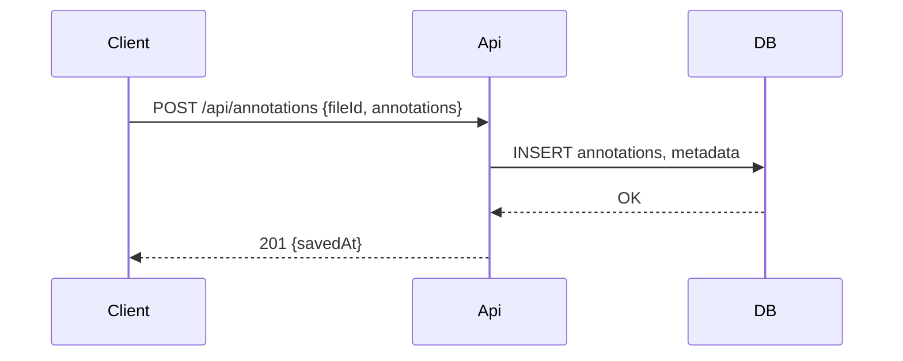

# Design Document — pdf-overlay-annotator

## Overview
この設計は、ユーザーが Web 上で PDF を読み込み、その上に重ねたオーバーレイ上で図形・テキストを作成・編集・保存・共有できる機能（pdf-overlay-annotator）を実装するための技術設計を示します。対象はフロントエンド中心の機能（クライアントレンダリング＋注釈永続化）です。

### Goals
- PDF の正確で高速な表示
- オーバーレイ上での低遅延な描画・編集（Undo/Redo を含む）
- 注釈の永続化と復元、PDF への埋め込みエクスポート

### Non-Goals
- PDF 変換バックエンドの大規模設計（OCR/高度な解析は範囲外）

## High-Level Architecture

```mermaid
graph TB
  Browser[Client (React + TypeScript)] -->|レンダリング/操作| PDFRenderer[PDF Renderer (PDF.js)]
  Browser -->|オーバーレイ描画| Overlay[Overlay Service (Canvas/SVG)]
  Browser -->|保存/取得| ApiGateway[API (REST)]
  ApiGateway --> AnnotationService[Annotation Service]
  AnnotationService --> Database[(Postgres / Object Store)]
  AnnotationService -->|Export| Exporter[PDF Exporter]
```

### Discovery Type
フル（greenfield 相当） — フロントエンド中心だが外部永続化とエクスポートが必要なため複数コンポーネント間の厳密なインターフェース設計が必要。

## Technology Stack（推奨）
- Frontend: React + TypeScript
- PDF Rendering: Mozilla PDF.js（クライアントサイドレンダリング）
- Overlay: HTML5 Canvas を主線で採用（パフォーマンス重視）、必要に応じて選択/選中部分は SVG を併用
- State: Redux Toolkit / Zustand（Undo/Redo 実装容易性）
- Backend API: Node.js + Express / Fastify（軽量 REST）
- Storage: PostgreSQL（メタ） + オブジェクトストレージ（PDF ファイル）

## Key Design Decisions

- **Decision**: PDF.js をクライアントで使用
  - Context: 高速なページ切替・レンダリングを求めるため
  - Alternatives: サーバーサイドレンダリング（PDF→画像）
  - Selected: PDF.js（クライアント） — ネットワーク帯域とサーバ負荷を抑え、インタラクティブ性を確保
  - Trade-offs: 初回ロードでクライアント側負荷があるが UX を優先

- **Decision**: 描画は Canvas ベース、選択等の操作で SVG を補助
  - Context: 多数の図形を高速に描画・再描画する必要がある
  - Alternatives: 純粋 SVG（編集は簡単だが多数オブジェクトで遅くなる）
  - Selected: Canvas 主体（高速レンダリング） + SVG レイヤでヒットテスト/アクセシビリティ

- **Decision**: 注釈データは JSON モデルで保存し、エクスポート時に PDF に埋め込む
  - Rationale: 柔軟性とバージョニング、差分保存が容易

## Components and Interfaces

### PDFRenderer (Client)
- Responsibility: PDF の読み込みとビットマップレンダリングを提供する
- External: PDF.js

### OverlayService (Client)
- Responsibility: 描画ツール・描画状態管理・Undo/Redo・選択/変形を提供
- Contract (抜粋, TypeScript 型):
```typescript
type AnnotationId = string;
interface Annotation {
  id: AnnotationId;
  type: 'rect' | 'circle' | 'line' | 'path' | 'text';
  page: number;
  bbox: { x: number; y: number; w: number; h: number };
  attributes: Record<string, any>; // color, strokeWidth, text内容等
  createdAt: string;
  updatedAt?: string;
}

interface OverlayServiceAPI {
  create(annotation: Annotation): Promise<Annotation>;
  update(id: AnnotationId, patch: Partial<Annotation>): Promise<Annotation>;
  delete(id: AnnotationId): Promise<void>;
  list(page: number): Promise<Annotation[]>;
}
```

### Annotation Service (Backend)
- Responsibility: 注釈の永続化、バージョン管理、エクスポート処理
- API Contract (REST):
| Method | Endpoint | Request | Response |
|---|---:|---|---|
| POST | /api/annotations | {fileId, annotations: Annotation[]} | 201, {id, savedAt} |
| GET | /api/annotations?fileId=&page= |  | 200, {annotations: Annotation[]} |
| POST | /api/annotations/export | {fileId, format:'pdf'|'json'} | 200, {url} |

## Data Model (Annotation JSON)
- 基本スキーマは上の `Annotation` 型をベースとし、バージョンフィールドと差分履歴を持たせる。保存はトランザクション内でメタ情報（fileId, owner, permissions）と合わせて保持。

## System Flows

#### Save / Load シーケンス


## Error Handling
- クライアント側バリデーションで早期弾き（400）→ サーバ側で整合性チェック（409/422）→ サーバ障害は 5xx として扱う
- ネットワーク失敗時はローカルキャッシュ（IndexedDB）に保存して再送リトライ

## Testing Strategy
- Unit: Overlay 操作ロジック（create/update/delete/undo/redo）
- Integration: 保存→復元フロー、エクスポート整合性テスト
- E2E: 主要ユーザー操作（PDF 読込→描画→保存→再読み込み）
- Performance: 大きな PDF（100+ ページ）とページ内 100 個の注釈でレスポンス計測

## Security & Permissions
- HTTPS 必須、認証は JWT ベースを想定
- 注釈リソースに対して閲覧/編集権限を実装（ACL）

## Traceability（要件 → コンポーネント）
- PDF 読込/表示 → PDFRenderer
- 描画/編集 → OverlayService
- 保存/復元/エクスポート → Annotation Service + Exporter

## Open Risks & Next Investigations
- PDF.js の大規模ドキュメントでのメモリ挙動を実環境で検証する必要がある
- Canvas と SVG のハイブリッド実装でのアクセシビリティ実装指針を確定する必要あり

---
設計書（上）は実装チームが参照できるレベルのアーキテクチャと契約を含みます。変更や詳細が必要なら指示ください。
